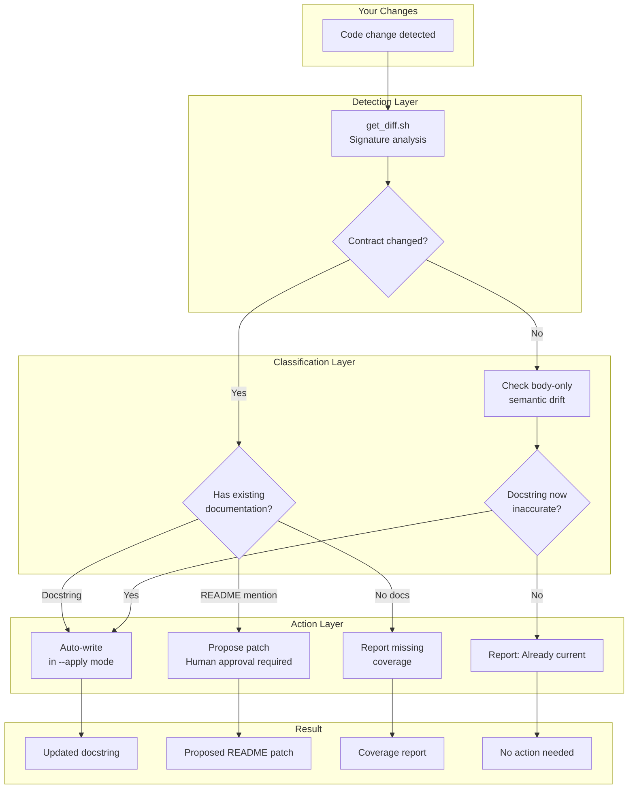

# doc-sync

[](https://tessl.io/registry/akshay-babbar/doc-sync)

Auto-sync docstrings and README when your code changes. When a function
signature changes, `doc-sync` finds every stale doc and proposes surgical
patches — dry-run first, writes only on your approval.

## How It Works



## What Gets Updated

| Location | Change Type | Behavior |
|----------|-------------|----------|
| **Docstrings** | Parameter/return changes | Auto-write in `--apply` mode |
| **README sections** | Code span mentions | Propose-first, human approval required |
| **Protected files** | CHANGELOG, ADRs, LICENSE | Never touched |

## Quick Start

### Install

```bash
npx tessl install akshay-babbar/doc-sync
```

### Usage

```bash
# Preview changes (default)
/doc-sync --dry-run

# Apply docstring updates
/doc-sync --apply

# Check committed changes
/doc-sync --dry-run HEAD~3..HEAD
```

## Before / After

**Code change:**
```diff
- def fetch_user(user_id: int) -> User:
+ def fetch_user(user_id: int, include_profile: bool = False) -> User:
```

**Docstring — auto-written:**
```diff
  Args:
      user_id: The user's unique identifier.
+     include_profile: Whether to include profile data. Defaults to False.
```

**README — proposed, never auto-applied:**
```diff
- `fetch_user(user_id)` — fetches a user by ID.
+ `fetch_user(user_id, include_profile=False)` — fetches a user by ID.
```

## The Trust Model

```
┌─────────────────────────────────────────────────────────────┐
│                    YOUR DOCUMENTATION                        │
├─────────────────────────────────────────────────────────────┤
│                                                             │
│   DOCSTRINGS                    README / MARKDOWN           │
│   ┌──────────────┐              ┌──────────────────┐        │
│   │  Auto-write  │              │   Propose-first  │        │
│   │  in --apply  │              │  Human approval  │        │
│   └──────────────┘              └──────────────────┘        │
│                                                             │
│   PROTECTED FILES (never modified)                          │
│   ┌────────────────────────────────────────────────┐        │
│   │  CHANGELOG.md  │  ADR-*.md  │  LICENSE  │  SECURITY.md  │
│   └────────────────────────────────────────────────┘        │
│                                                             │
└─────────────────────────────────────────────────────────────┘
```

## Language Support

| Language | Functions | Classes | Private Methods |
|----------|-----------|---------|-----------------|
| Python | ✅ | ✅ | ✅ (if documented) |
| TypeScript/JavaScript | ✅ | ✅ | ✅ (if documented) |
| Go | ✅ | ✅ | ✅ (if documented) |
| Rust | ✅ | ✅ | ✅ (if documented) |
| Ruby | ✅ | ✅ | ✅ (if documented) |
| Java/Kotlin | ✅ | ✅ | ✅ (if documented) |

## Post-Commit Hook (Optional)

For automatic checks after every commit:

```bash
# .git/hooks/post-commit
#!/bin/bash
claude -p "/doc-sync --dry-run"
```

```bash
chmod +x .git/hooks/post-commit
```

## Design Philosophy

| Principle | Implementation |
|-----------|----------------|
| **Conservative** | Flag more, change less. False positives over false negatives. |
| **Transparent** | Every change explained, every skip documented. |
| **Reversible** | Never auto-commits. `git checkout` always works. |
| **Minimal** | One parameter change = one parameter doc updated. No "improvements." |

## What It Does NOT Do

- Generate new documentation from scratch
- Update behavioral descriptions (performance, policy, security)
- Modify examples, warnings, or notes
- Touch CHANGELOGs or architectural decision records
- Require AST parsers or external dependencies

## Platform Compatibility

| Platform | Status | Notes |
|----------|--------|-------|
| Claude Code | ✅ | Full support with hooks |
| Windsurf | ✅ | Auto-loads from `.agents/skills/` |
| Cursor | ✅ | Auto-loads from `.cursor/skills/` |
| OpenCode | ✅ | Manual install to `~/.config/opencode/skills/` |

## License

Apache 2.0
